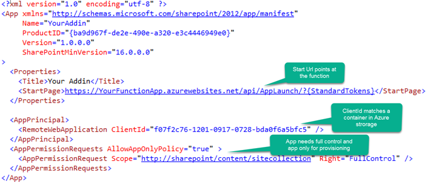
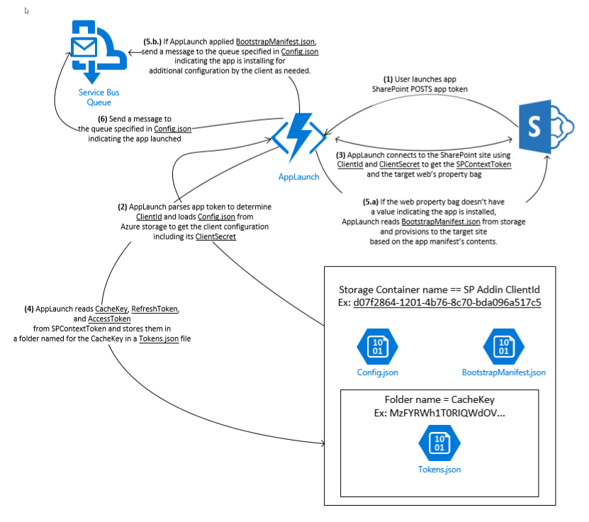

# Understanding the AppLaunch Function
AppLaunch acts as the startup controller for a SharePoint addin. It requires the addin to demand full control permissions and allow app only identity. A typical [SharePoint addin app manifest](SPAppManifest.md) resembles the following:

The full control requirement is a result of the fact that AppLaunch uses the target web's property bag to determine the app's install status and because most apps provision some amount of html, javascript, or other file types that require this permission. If you don't have a UI, you can refactor the function to use something other than the property bag if you need a more restrictive permission set.

The app only requirement is due to the fact that the [[EventDispatch]] function ignores events raised by app only identities as an easy way to avoid event loops.

# Dependencies
The most important direct dependencies are:
* [SharePoint.Online.CSOM](https://www.nuget.org/packages/Microsoft.SharePointOnline.CSOM/)
* [InstantQuick.SharePoint.Provisioning](https://github.com/InstantQuick/IQAppProvisioningBaseClasses/)
* [[BootstrapProvisioner]]
* [[ClientConfiguration]]
* [[FunctionsCore]]
* [[IQAppCommon]]
* [[TokenStorage]]

Look at the project in Visual Studio for the complete set of dependencies.

# Configuration
* [[Azure Function App Configuration]]
* [[Configuring the Function for a SharePoint Addin]]
    * [[Config.json Files]]
    * [[Bootstrap Provisioning]]

# What it Does
