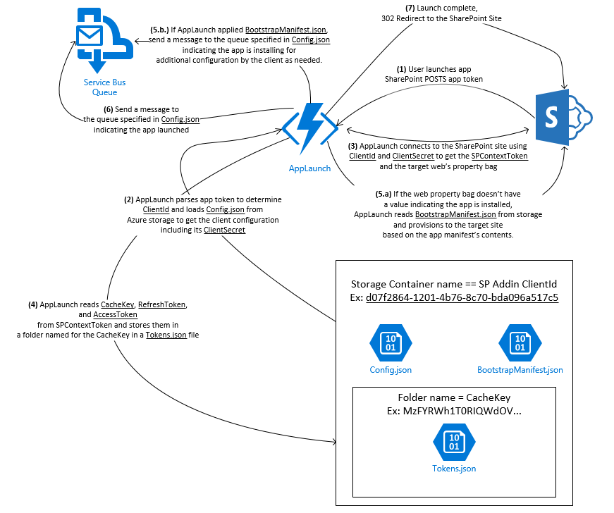

# Understanding the AppLaunch Function
AppLaunch acts as the startup controller for a SharePoint add-in. It requires the add-in to demand full control permissions and allow app only identity. A typical [SharePoint addin app manifest](SPAppManifest.md) resembles the following:

The requirement for the FullControl right is a result of the fact that AppLaunch uses the target web's property bag to determine 
the app's install status and because most add-ins provision some amount of HTML, JavaScript, or other file types that require this permission. 
If you don't have a UI, you can refactor the function to use something other than the property bag if you need a more restrictive permission set.

The requirement for AllowAppOnlyPolicy is due to the fact that the [EventDispatch](EventDispatch.html) function ignores events raised 
by app-only identities as an easy way to avoid event loops.

## What it Does
1. The user launches the app and SharePoint POSTS the app's context info to the AppLaunch endpoint in the function app
2. AppLaunch parses app token to determine ClientId and loads Config.json from Azure storage to get the client configuration including its ClientSecret
3. AppLaunch connects to the SharePoint site using ClientId and ClientSecret to get the SPContextToken and the target web’s property bag
4. AppLaunch reads CacheKey, RefreshToken, and AccessToken from SPContextToken and stores them in a folder named for the CacheKey in a Tokens.json file
5. AppLaunch reads the SharePoint Web's property bag to determine if the app is installed
   1. If the web property bag doesn't have a value indicating the app is installed, AppLaunch reads BootstrapManifest.json from storage and provisions to the target site based on the app manifest’s contents.
   2. If AppLaunch applied BootstrapManifest.json, send a message to the queue specified in Config.json indicating the app is installing for additional configuration by the client as needed.
6. AppLaunch sends a message to the Service Bus queue specified in Config.json indicating the app launched 
7. Launch complete, 302 Redirect to the SharePoint Site

The function's execution flow is shown below.  

## Client Configuration
Azure Functions for SharePoint is multi-tenant in that it can service add-ins installed broadly across SharePoint Online 
and also because the back-end processes that respond to client specific events in SharePoint 
or rely on Azure Functions for SharePoint for security token management can be located anywhere with a connection to the Internet. 

See the [Client Configuration Guide](ClientConfiguration.md) for more information. 

## Bootstrap Provisioning
AppLaunch has the ability to create a wide range of items and configurations in a target SharePoint site. It uses the [IQAppProvisioningBaseClasses library](https://github.com/InstantQuick/IQAppProvisioningBaseClasses) for provisioning 
and you can easily create packages using the tools found in the [InstantQuick SharePoint Provisioning](https://github.com/InstantQuick/InstantQuick-SharePoint-Provisioning) project. 

This operation blocks the launch flow until it completes. This means that when a user launches the app, they will see a blank browser page for the duration of the provisioning process. 
Although it is possible provision an entire app if the app is small, the intended use of this class is for the bare minimum provisioning of the app, such as temporary home page to notify the user additional setup is taking place.

AppLaunch queues a QueuedSharePointProvisioningEvent message your client can handle for long running provisioning jobs. 
If you currently have an investment in your own provisioning system, you should invoke it in response to receiving a message from the queue.

See the [Bootstrap Provisioning Guide](BootstrapProvisioning.md) for more information. 